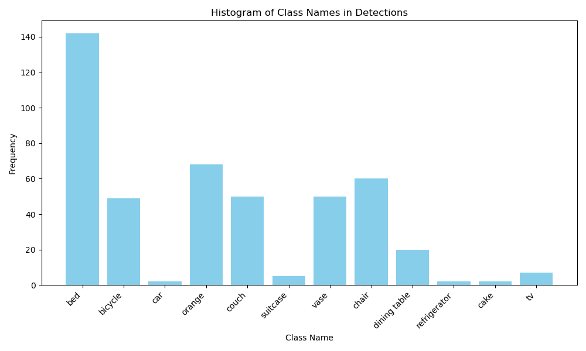

Where are the relevant files

Detector code
- /detector/object_detector
Subscriber code
- /detector/event_subscriber
SQL related code
- /detector/database/postgresql.py
Model related code
- /tb_worlds/launch/block_spawner.launch.py (modified for benches)
- /models

Histogram:
