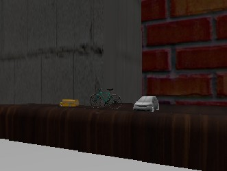
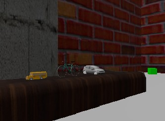
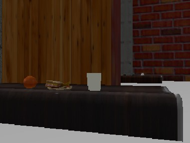
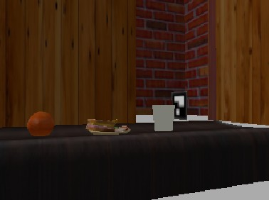
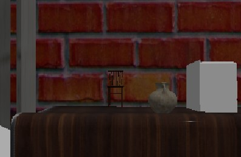
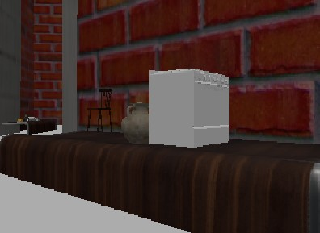

Create world_assets.md containing:

    Bench IDs
    Bench approximate poses
    Object list per bench
    Two screenshots per bench from robot camera view

## Bench 1 (vehicles)
- ID: bench_with_vehicles
- Pose: [-0.15, -1.3, -0.12, 0, 0, 1.57]
- Objects: bus, bike, car
- Screenshots:

## Bench 2 (food)
- ID: bench_with_food
- Pose: [0.1, 1.5, -0.12, 0, 0, -1.57]
- Objects: orange, sandwich, cup
- Screenshots:

## Bench 3 (furniture)
- ID: bench_with_furniture
- Pose: [2.6, 0.0, -0.12, 0, 0, -0.7853]
- Objects: chair, vase, oven
- Screenshots:

